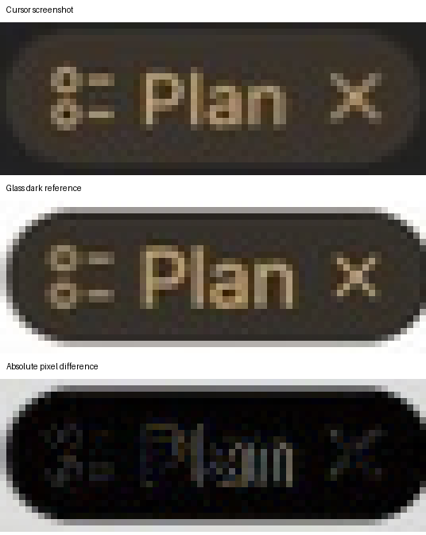

# Plan control screenshot comparison

The crops come from CUA screenshots of Cursor and Glass. They are 67 × 24 pixels, aligned by translation without resizing or recoloring. The comparison image enlarges each crop 8× with nearest-neighbor sampling for inspection.

Run with Python and Pillow:

```sh
python3 scripts/compare-control-pixels.py docs/visual-checks/plan/cursor.png docs/visual-checks/plan/glass-dark.png --mask docs/visual-checks/plan/interior-mask.png --output docs/visual-checks/plan
```

`metrics.json` reports both the full crop and the declared interior mask. The mask excludes outer compositing against the different dark and light composer backgrounds. Neither metric is a claim of exact equality. The final dark candidate has an interior mean absolute RGB error of 14.10 out of 255; the full crop error is 49.80. The two screenshots are **not pixel-identical**. Font rasterization, positioning, and boundary pixels still differ.

The default light control uses the same capsule geometry at 85% scale, with the supplied light reference colors: cream #f0eae1 and amber #9c6a23, without an outline. The full-size dark version is retained behind `[data-theme="dark"]`; this does not implement an application-wide theme switch.



The later supplied light reference is saved in `light/supplied-reference.png`. Its crop is resized with Lanczos sampling to the compact captured control size before comparison; this normalization is explicit and is not a raw pixel-identity claim. The comparison script itself never resizes images.
